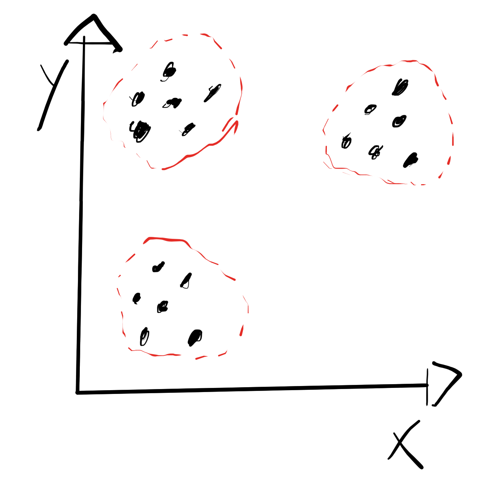
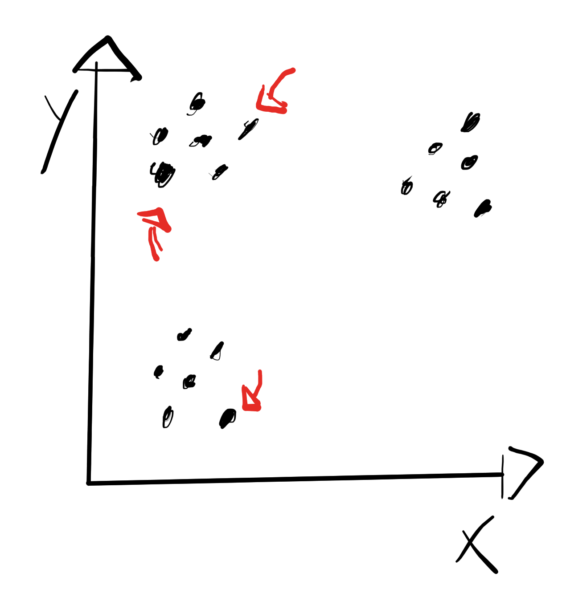
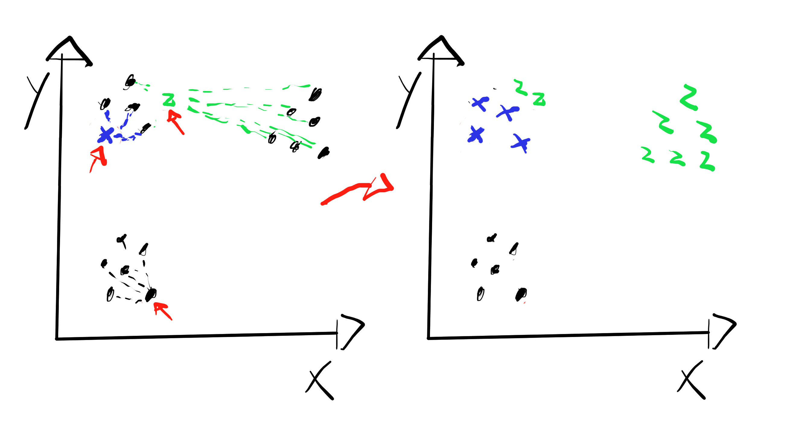
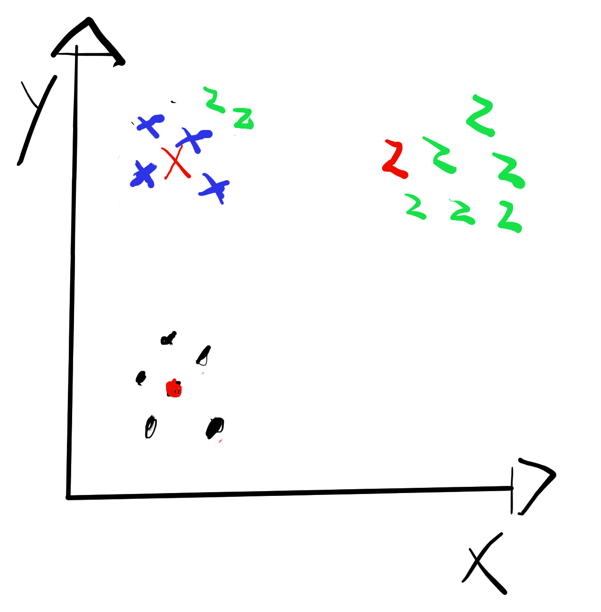
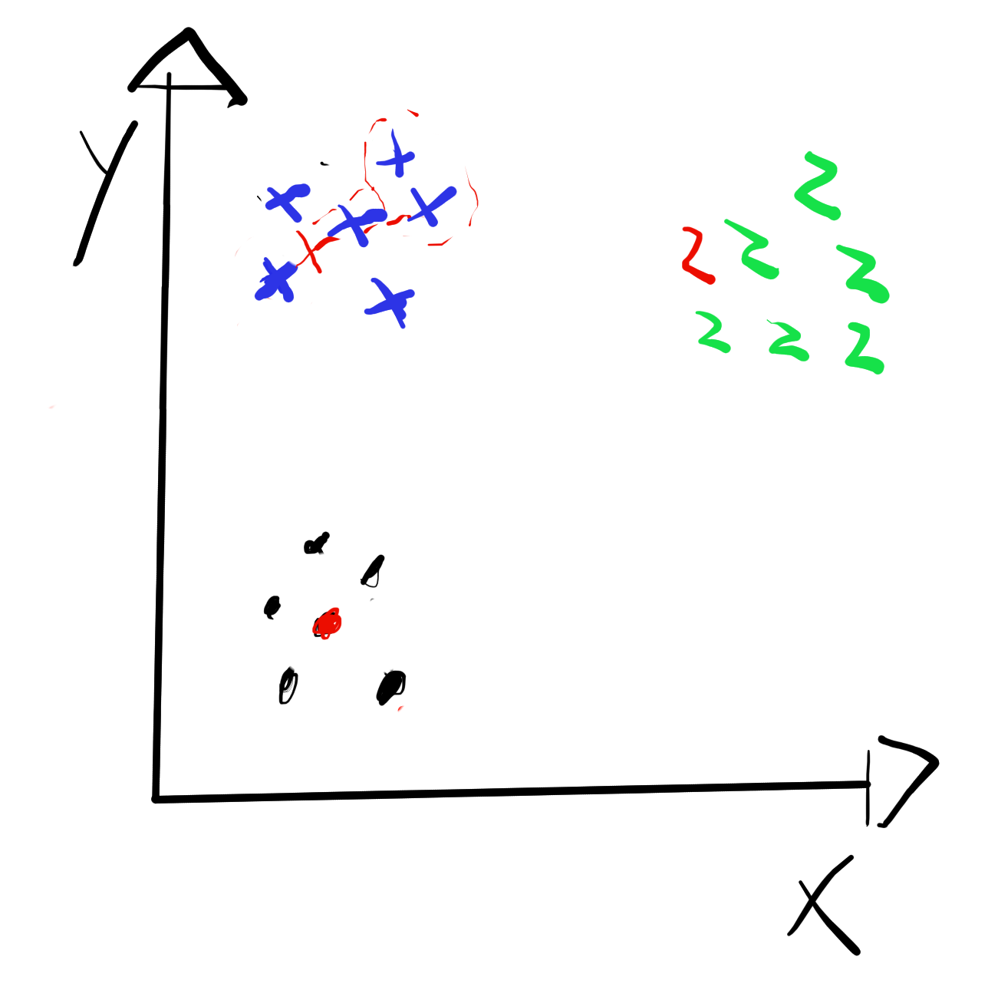
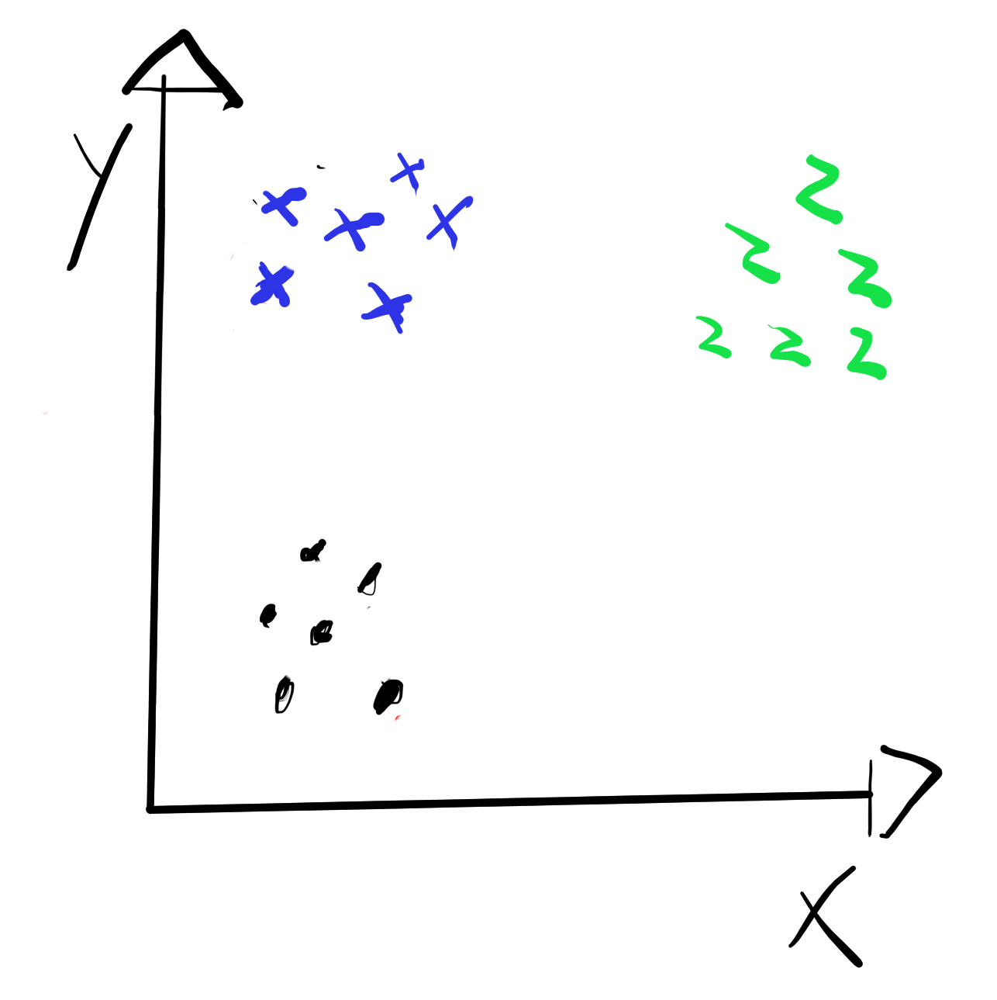

# K Means Clustering Model From Scratch

This implementation goal is to implement K Means Clusterization based on the euclidean distance in a simple way, as well as all of the models in this directory.

 

Kmeans Clust is a ML model intended for segragating data into groups (clusters) based on its features. Looking at the image below, it is easy to see that we can segretate those points into 3 groups:

 

 

For that task, initially, n (number of clusters) random points are select and initilized as the "centroids":

 

 

Then, some clusters are created based on the distance from the data points to these centroids. Each centroid defines a cluster, and the poinst that are closest to this centroids, is considered a part of the cluster defined by that centroids.

 

 

Afther that, the mean point of that cluster if calculated and a new centroid for that cluster is attributed to that mean (these new centroids, does not need to be existing data points this time):

 

 

Now, new clusters are defined based od the distance from the points to these new centroids:

 

 

This process is iteratted for max_iters times or until a criteria is matched (something like the centroids dont change the location for an iteration).

 

At the end, we have separated data points into groups (clusters)

 

