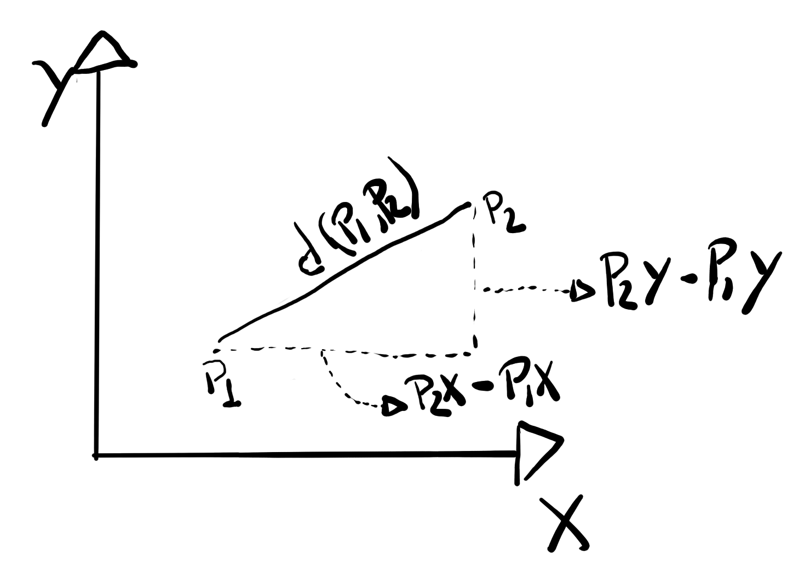
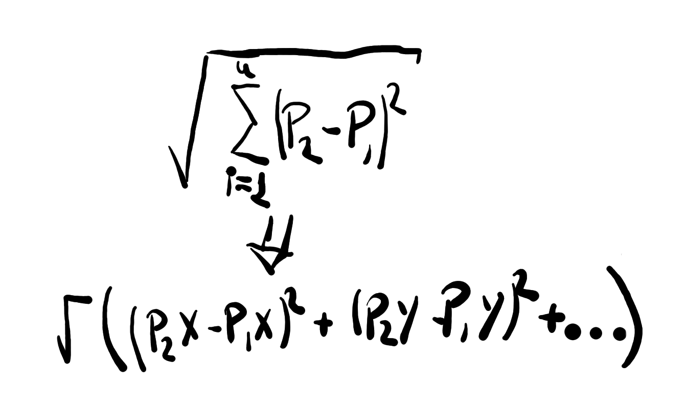
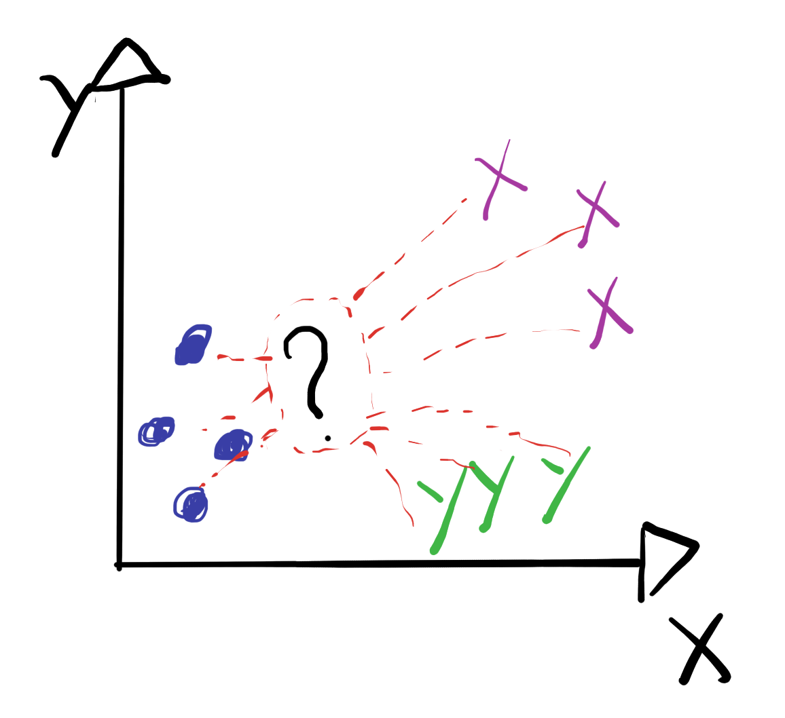

# K Nearest Neighbors Model Implementation

This implementation goal is to implement K Nearest Neighbors Classificator based on the euclidean distance in a simple way, as well as all of the models in this directory.

 

First of all, KNN models has its cores on calculation the distance between points, basically using Pythagoras Theorem. For example:

 

 

The distance "d" in the image represents the Euclidean Distance between p1 and p2, and altought here it is presented in a bidimensional plot, it is possible to calculate it over diverses dimensions by:

 

 

Then, what KNN model does, is simply calculate the euclidean distance between a test points and the points used for training, then, the model identify the "k" nearests points to the testing point, and with that, the label for the testing point can be defined.

 

 

If the model is a regressor model, it can return the mean values between the k nearest points values, and if it is a classificator, if will return the label which is most common between the k nearest points labels.