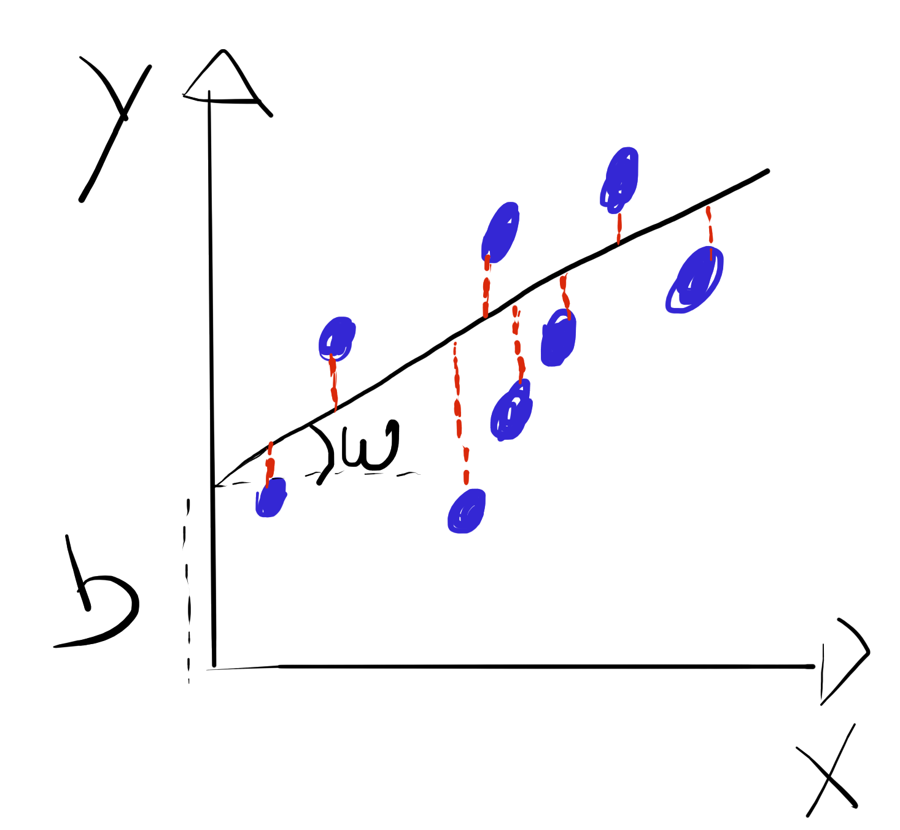
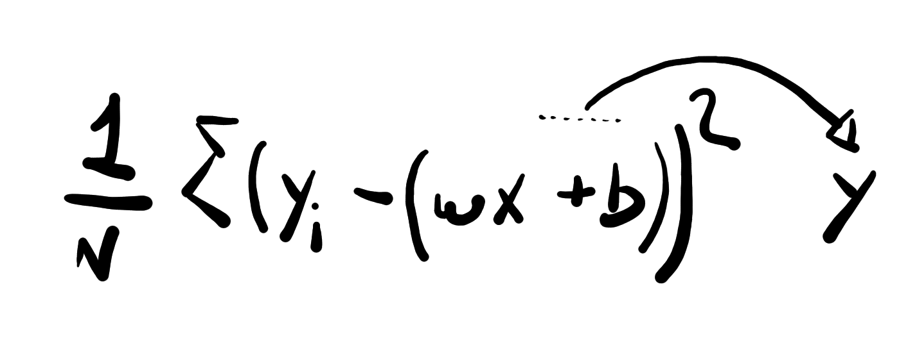
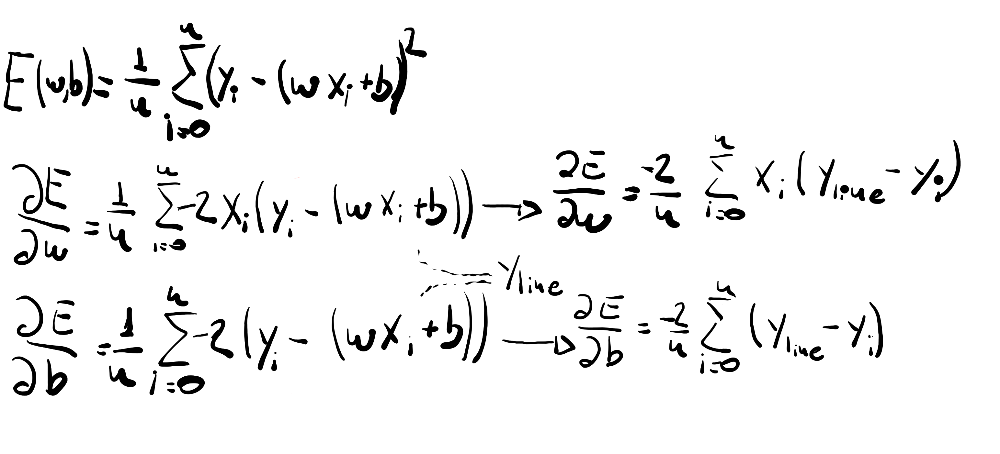
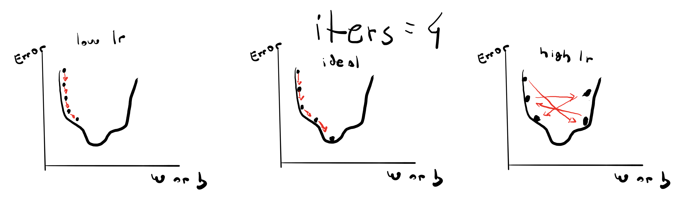

# Linear Regression Model Implementation

In order to better undertand this mode implementation, it is important to understand the line equation first.
 

The line equation is defined by: <b>y = wx + b</b>, where y is a y coord, x is the x coord relative to that y, w is the weight of the funcion and b is the bias.
The weight of that function represents the slope of the line defined by the function, and the bias represents how much the height on the line varies in the Y axis where x = 0.
Hence,  with these 2 paremters, it is posible to determine a line function.

 

 

In the image above we can see the representation of the w and b values.
We can also see the error metric we will use for this implementation, MAE (Mean Absolute Error), represented by the doted lines linking the points to the line.
Basically, what MAE does is take the diff between the Original Y of a point (yi), and the Y the line represents by that very same point (y), this diff is ^2 and all these values, for all the points are summed and then divided by the number of points:

 

 

Since we want to reduce this error, one way to facilitate this process is by using derivates.
Derivatives can be used to measure the variation of a function in relation to a variable in that function. In our case, our MAE function has 2 variables, w and b, so, our error function will be: E(w,b).
Hence, our derivatives will be:

 

 

By having a way to calculate our weight and bias varation, whe can implement a technique called Gradient Descent, where we can reduce our current variable usint it variation. So, for our weight, for exemplo, we may do something like: w = w - lr * dw (where lr = learning rate and dw is the w variation given by the equation above).
This process is done a number of times (number of iteration), in a way where the w value is updated every time. The same happens for the bias value.
n_iterations and the learning rate are hyperparameters given by the user ont he model initialization.

Our goal is to find dw as close to zero as possible, at that point, weight and bias values should not change a lot anymore.
At the end of the iterations, our weight and bias values should give us the line which best represents the points given.

  

A image representing the influence of the "learning rate" with number of iterations:

 

